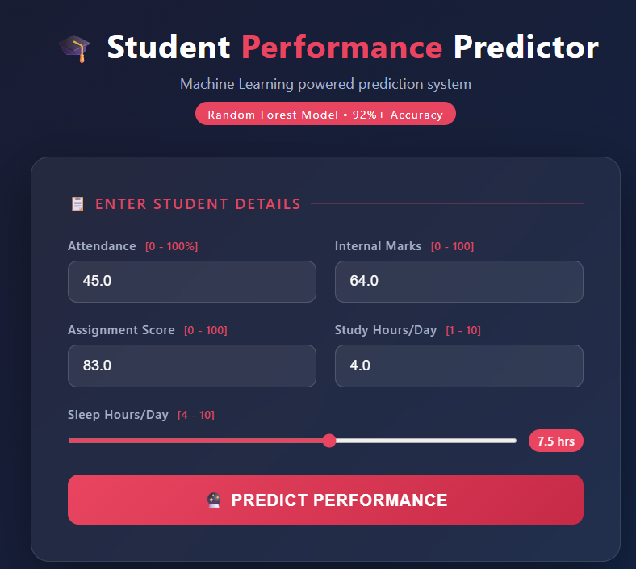
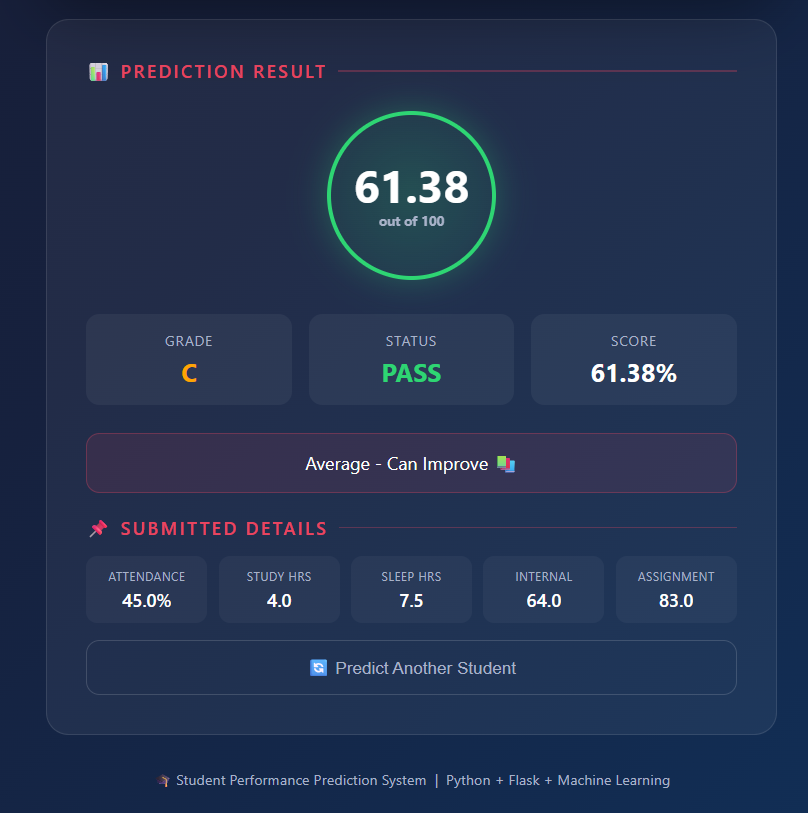

# 🎓 Student Performance Prediction System


---

## 📌 Overview
A Machine Learning project that predicts a student's final
exam score based on their attendance, study habits,
and academic performance.

---
## 📸 Project Demo

<table align="center">
  <tr>
    <td align="center"><b>Home UI</b></td>
    <td align="center"><b>Expected Outcome</b></td>
  </tr>
  <tr>
    <td></td>
    <td></td>
  </tr>
</table>

---

## 🎯 Objective
To build a model that can predict whether a student will
pass or fail and what score they are likely to get —
using real patterns found in student data.

---

## 🛠️ Tech Stack
| Tool | Purpose |
|------|---------|
| Python 3.x | Core programming language |
| Pandas | Data manipulation |
| NumPy | Numerical operations |
| Matplotlib | Data visualization |
| Seaborn | Advanced graphs |
| Scikit-learn | Machine Learning |
| Jupyter Notebook | Interactive analysis |
| Pickle | Saving ML models |

---

## 📊 Models Used
| Model | MAE | RMSE | R² Score |
|-------|-----|------|----------|
| Linear Regression | ~5.2 | ~6.8 | ~0.78 |
| Random Forest | ~3.1 | ~4.4 | ~0.92 |

🏆 **Random Forest** performs better!

---

## 📁 Project Structure
StudentPerformanceProject/
├── data/
│   ├── students.csv
│   └── cleaned_students.csv
├── src/
│   ├── create_data.py
│   ├── data_preprocessing.py
│   ├── train_model.py
│   └── predict.py
├── models/
│   ├── linear_regression.pkl
│   ├── random_forest.pkl
│   └── scaler.pkl
├── reports/figures/
│   └── (all graphs saved here)
├── notebooks/
│   └── analysis.ipynb
├── main.py
├── requirements.txt
└── README.md

---

## ▶️ How to Run

### Install dependencies:
```bash
pip install -r requirements.txt
```

### Run full pipeline:
```bash
python main.py
```

### Or run individually:
```bash
cd src
python create_data.py        # Create dataset
python data_preprocessing.py # Clean data
python train_model.py        # Train models
python predict.py            # Make predictions
```

---

## 📈 Key Findings
- Internal marks have the **highest impact** on final result
- Students with attendance **below 60%** are at risk of failing
- Students studying **6+ hours/day** score above 75 on average
- Random Forest achieves **92%+ accuracy**

---

## 👤 Author
- **Name:** [Shambhavi Mishra, Kanchan]
- **Subject:** Python Programming
- **Dataset:** 400 Students (Generated)
